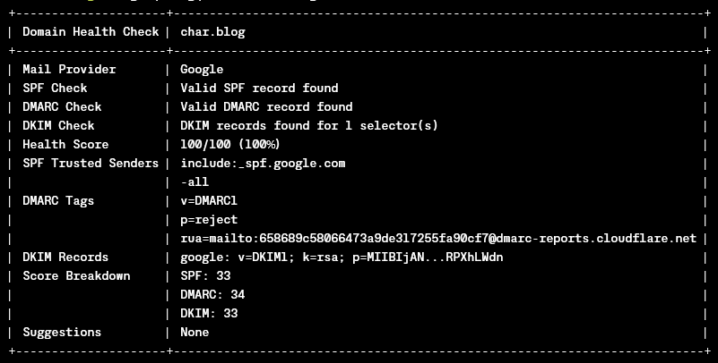
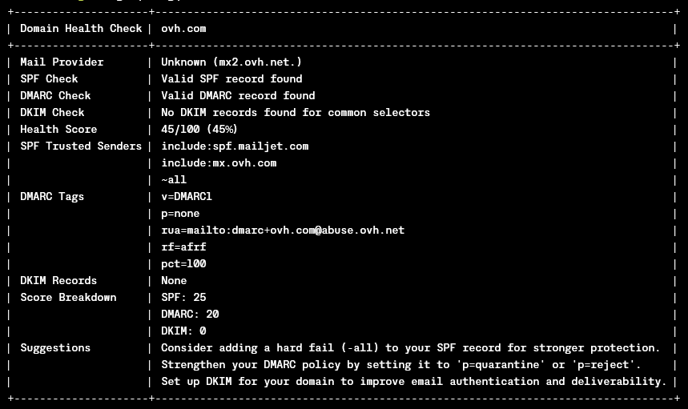

# Domain Health (dh) CLI Tool

A command-line interface tool for checking and scoring the email security configuration of a domain.

## Features

- Checks mail provider (e.g., Google, Microsoft, Mimecast)
- Verifies SPF (Sender Policy Framework) records
- Checks DMARC (Domain-based Message Authentication, Reporting, and Conformance) configuration
- Verifies DKIM (DomainKeys Identified Mail) records
- Calculates a health score based on SPF, DMARC, and DKIM configurations
- Provides suggestions for improving email security
- Displays an easy-to-read summary of domain email security

## Usage

```shell
dh <domain>
```

Example:

```shell
dh example.com
```

## Output

The tool provides a formatted table output including:

- Domain being checked
- Detected mail provider
- SPF record status and trusted senders
- DMARC configuration
- DKIM record status
- Overall health score (out of 100)
- Breakdown of the health score
- Suggestions for improvement

### Example Outputs

#### Healthy Domain Configuration



#### Unhealthy Domain Configuration



## Health Score Calculation

The health score is calculated based on the following criteria:

- SPF: Up to 33 points
  - 33 points for valid SPF with hard fail (-all)
  - 29 points for valid SPF with soft fail (~all)
  - 25 points for valid SPF without explicit fail
- DMARC: Up to 34 points
  - 34 points for p=reject
  - 25 points for p=quarantine
  - 20 points for p=none or no policy specified
- DKIM: 33 points for valid DKIM record

## Requirements

- Rust (latest stable version)

## Installation

1. Clone the repository
2. Run `cargo build --release`
3. The binary will be available in `target/release/dh`

## License

[GNU GENERAL PUBLIC LICENSE](LICENSE)
